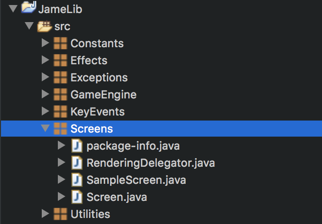
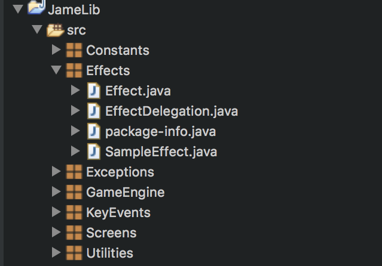

# JameLib
このプロジェクトはJava言語を用いたゲーム制作を用意にするためのフレームワークとして機能します。環境はeclipseを想定していますが、その他のエディタを用いる場合はパスを各自で設定し直してください。機能がある程度整備されればライブラリ化を図りますが、暫くは教育用のフレームワークという立ち位置で開発を進めます。

## Usage
  
 図のScreens階層に、SampleScreenに倣って自分の作成したいスクリーンクラスを作成します。その際、IRenderingDelegationインターフェースを実装(implements)するようにしてください。  

### スクリーンの作成例
スクリーンを作成します。

    public class SampleScreen implements IRenderingDelegation {

    	@Override
    	public void initialize() {
    		/* ここに初期化したい処理を書きます */
    	}

    	@Override
    	public void update() {
    		/* ここに更新したい処理を書きます */
    	}

    	@Override
    	public void render(Graphics g) {
    		/* ここに描画したいものを書きます */
    	}

    	@Override
    	public void terminate() {
    		/* ここに終了処理を書きます */
    	}

    }

これは簡易的なスクリーンであり、拡張することができます。各自で実装した型、変数を用いてスクリーンを装飾してください。

### スクリーンの登録
作成したスクリーンは以下のようにコンテナで登録します。

    public class MainContainer extends JPanel implements Runnable {

        ~~~~~~~~~~~~~~~~~~~~~~~~~~~~~~~~~~~~~~~~~~~~~~~~~~~~~~~~~~~~~~

        public void screenRegister(){
      		  this._relegator.bindRenderer("sample", new SampleScreen());
            ...
      		  this._relegator.swapChain("sample");
        }

        ~~~~~~~~~~~~~~~~~~~~~~~~~~~~~~~~~~~~~~~~~~~~~~~~~~~~~~~~~~~~~~

    }

上記の~で区切られたエリアは、省略したコードが存在することを表します。スクリーンの登録に必要な操作は、MainContainerクラスのscreenRegister()メソッドにbindRenderer()を書き足すだけです。実行時には、最後に追加されたスクリーンが初期値として扱われるので、screenRegister()の最後で画面切り替えメソッドのswapChain()で最初のスクリーンに入れ替えることを忘れないでください。

### エフェクトの作成
  
 図のEffects階層に、SampleEffectに倣って自分の作成したいエフェクトクラスを作成します。その際、IEffectDelegationインターフェースを実装(implements)するようにしてください。  

### エフェクトの作成例
以下のようにエフェクトクラスを作成します。

    public class SampleEffect implements IEffectDelegation {
    	int radius = 10;
    	Image image;

    	public SampleEffect() {
    		initialize();
    	}

    	@Override
    	public void initialize(){
    		try {
    			this.image = (ImageLoader.loadImage("images/effect/sample_effect.jpg"));
    		}catch(NotFoundException en){
    			en.printStackTrace();
    		}
    		catch (ImageLoadException ei) {
    			ei.printStackTrace();
    		}
    	}

    	@Override
    	public void update(){
    		this.radius+=1;
    	}

    	@Override
    	public void render(Graphics g) {
    		g.drawImage(this.image, 200 - this.radius, 300
    				- this.radius, 2 * this.radius, 2 * this.radius, null);
    	}

    }

これは簡易的なエフェクトであり、より高度なエフェクトに拡張することが可能です。作成したエフェクトを使用するには、エフェクトを使用したいスクリーン内で以下のように記述します。

### エフェクトの登録
作成したエフェクトをスクリーンに登録します。

    public class SampleScreen implements IRenderingDelegation {

        ~~~~~~~~~~~~~~~~~~~~~~~~~~~~~~~~~~~~~~~~~~~~~~~~~~~~~~~~~~~~~~

    	EffectDelegator delegator;

        @Override
        public void initialize() {
      	   this.delegator.bindEffect(new SampleEffect());
        }

        @Override
        public void update() {
            this.delegator.bindEffect(new SampleEffect());
        }

        @Override
        public void render(Graphics g) {
            this.delegator.delegate(g);
        }

        ~~~~~~~~~~~~~~~~~~~~~~~~~~~~~~~~~~~~~~~~~~~~~~~~~~~~~~~~~~~~~~

    }

作成したエフェクトを使用するには、使用したいスクリーンクラスの任意の箇所、条件のもとでbindEffect()を呼び出し、エフェクトを紐付けます。エフェクトをbindEffect()で紐付けする際には、注意すべきことがあります。  

+ 一度エフェクトを作成してから、意図したエフェクトの更新にかかる時間を設けずに次のエフェクトを紐付けすると、十分に更新されていないエフェクトが描画され続けます。(場合によってはエフェクトの存在に気づきません。)
+ bindEffect()を呼ぶと、必ずそのインスタンスのinitialize()メソッドが実行されます。(更新したくないパラメータもすべて初期値にリセットされます。)

1つ目の注意事項に関しては、特定の条件を満たした場合にのみエフェクトを紐付けするようにするか、カウンターを用意すれば解決できるでしょう。 
2つ目は、EffectDelegationにEffectのリスト構造を持たせ、その要素を切り替えることで対応ができるでしょう。

### コンテンツの読み込み
プログラムのアイコンやスクリーンの装飾のために、画像を取り扱いたい場合があります。JameLibでは、初期化関数などに次のように記述することで、画像の読み込みができます。

    public void initialize(){
        try {
            this._image = (ImageLoader.loadImage("images/effect/sample_effect.jpg"));
        }catch(NotFoundException en){
            en.printStackTrace();
        }
        catch (ImageLoadException ei) {
            ei.printStackTrace();
        }
    }

画像の読み込みでは、例外が発生する可能性があるので、try-catchブロックで囲む必要があります。また、NotFoundExceptionは、指定したパスに画像が存在していないことを表現します。指定したパスに画像が存在した上で、画像の読み込みに失敗した場合は、ImageLoadExceptionが発生します。サウンドの読み込みについても同様です。

### キードード入力の利用について
ゲームを作成する上で、キーボードからの入力を受け付けたいときは以下のようにします。

+ 特定のスクリーンに対するキーアクションクラスを定義します。
+ 作成したクラスにIKeyDelegationを実装(implements)します。
+ MainContainerのregistScreen()にキーアクションの紐付けの処理を追記します。  

キーアクションを行うクラスは以下のように定義します。

    public class SampleKeyAction implements IKeyDelegation {
    	private IRenderingDelegation _renderer;

    	@Override
    	public void keyTyped(KeyEvent e) {
    		//
    	}

    	@Override
    	public void keyPressed(KeyEvent e) {
    		System.out.println("typed!");
    		this._renderer.initialize();
    	}

    	@Override
    	public void keyReleased(KeyEvent e) {
    		//
    	}

    	@Override
    	public void bindDependedScreen(IRenderingDelegation renderer) {
    		this._renderer=renderer;
    	}

    }

キーアクションクラスにIRenderingDelegationのインスタンスを持たせれば、キーアクションからスクリーンの処理を制御することができます。また、MainContainerのscreenRegister()には次のように追記します。

    public class MainContainer extends JPanel implements Runnable {
        private KeyDelegator _kdelegator;

        ~~~~~~~~~~~~~~~~~~~~~~~~~~~~~~~~~~~~~~~~~~~~~~~~~~~~~~~~~~~~~~

        public void screenRegister(){
            SampleScreen sample=new SampleScreen();
            this._rdelegator.bindRenderer("sample", sample);
            this._kdelegator.bindKeyDelegation("sample", new SampleKeyAction(), sample);

            this._rdelegator.swapChain("sample");
            this._kdelegator.linkKeyDeielgation(this, "sample");
        }

        ~~~~~~~~~~~~~~~~~~~~~~~~~~~~~~~~~~~~~~~~~~~~~~~~~~~~~~~~~~~~~~

    }

MainContainerの持つKeyDelegatorインスタンスに対し、bindKeyDelegation()でスクリーンとキーアクションを紐付けます。この際、対応するスクリーンの識別子、作成したキーアクションのインスタンス、それに対応するスクリーンの実体を渡します。screenRegister()の最後に、swapChain()で最初に用いるスクリーンにスワップしたあと、linkKeyDeielgation()で対応するキーアクションクラスの識別子を選択します。これによりキーボードからの入力を受け付けることができます。
 
この例では、JPanelに対してキーアクションを紐付けし、キーインプットをリッスンしていますが、その他のコンポーネントにキーアクションを紐付けたい場合は、linkKeyDeielgation()の第一引数に指定したいコンポーネントを指定してください。

### フレームレートの固定
メインメソッドは最初以下のようになっています。

    public class GameMain {

    	public static void main(String[] args) {
    		JFrame frame=new JFrame();
    		frame.setFocusable(true);
    		frame.setVisible(true);
    		frame.setSize(WindowParams.width, WindowParams.height);
    		frame.setDefaultCloseOperation(JFrame.EXIT_ON_CLOSE);

    		MainContainer container=new MainContainer(frame, new FrameRate(60));
    		frame.getContentPane().add(container);

    		container.game_start();
    	}
    }

メインメソッド内でメインコンテナのインスタンスを生成する際、第二引数にFrameRateインスタンスを指定することができます。FrameRateインスタンスのコンストラクタは、希望するフレームレートをint型で受け取って初期化を行います。もし、引数でフレームレートを指定しなかった場合、デフォルトでフレームレート60で固定されます。

### ベースノードの利用
シューティングゲームなどの敵や自機などは画像で装飾されますが、実体はただの円や四角形です。JameLibには、そのようなノード(オブジェクト)が予め準備されており、比較的容易にノードを作成することが可能です。

 

---説明は委譲です。---

License
----------
Copyright &copy; 2017 arabian9ts
Distributed under the [MIT License][mit].

[MIT]: http://www.opensource.org/licenses/mit-license.php
