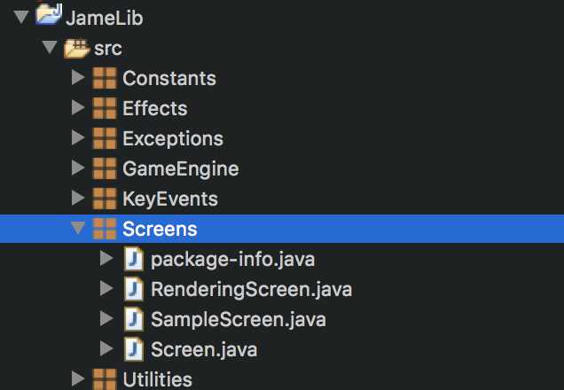

# JameLib
このプロジェクトはJava言語を用いたゲーム制作を用意にするためのフレームワークとして機能します。環境はeclipseを想定していますが、その他のエディタを用いる場合はパスを各自で設定し直してください。機能がある程度整備されればライブラリ化を図りますが、暫くは教育用のフレームワークという立ち位置で開発を進めます。

## Usage
  
 図のScreens階層に、SampleScreenに倣って自分の作成したいスクリーンクラスを作成します。その際、Screenインターフェースを実装(implements)するようにしてください。  

### スクリーンの作成
    
